1. Click on the proc Test file, a window will open as shown below.  
   [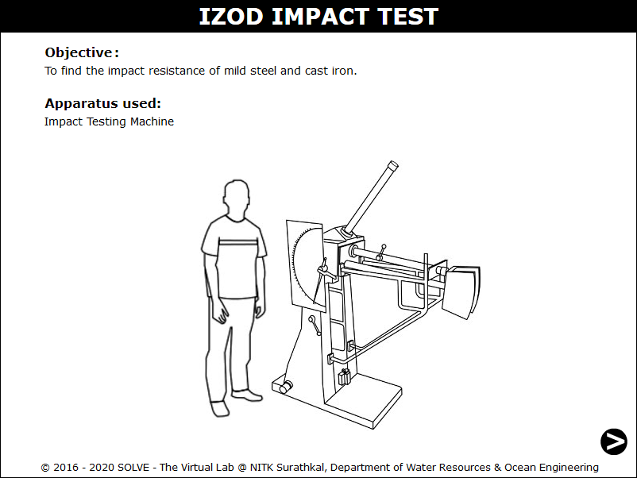](./images/proc1.png)

2. Click on the NEXT button to move to the next step.
   [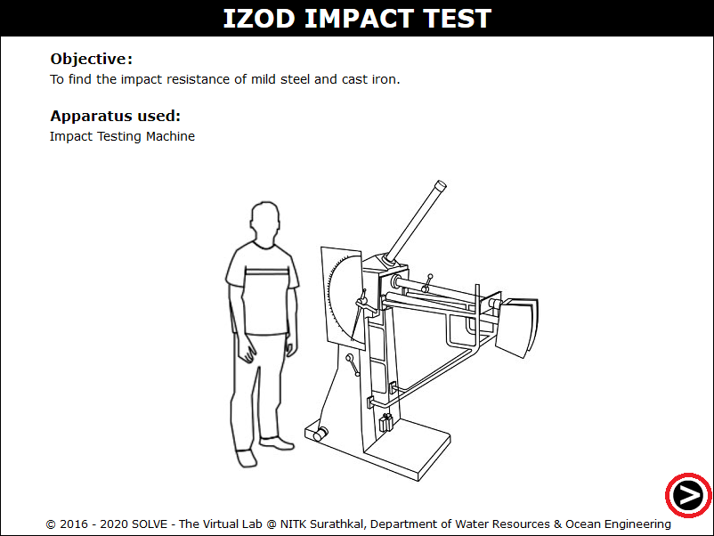](./images/proc2.png)

3. Select the specimen to be placed in the machines anvil.  
   [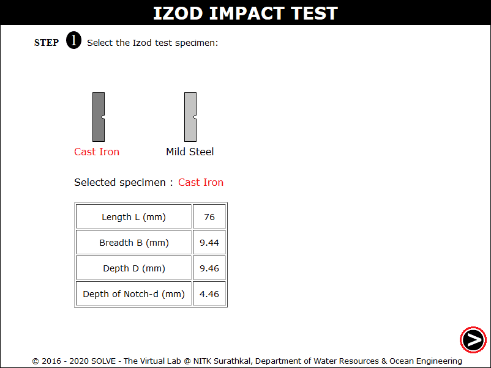](./images/proc5.png)

4. Click on hand lever to test for friction loss in the sample.  
   [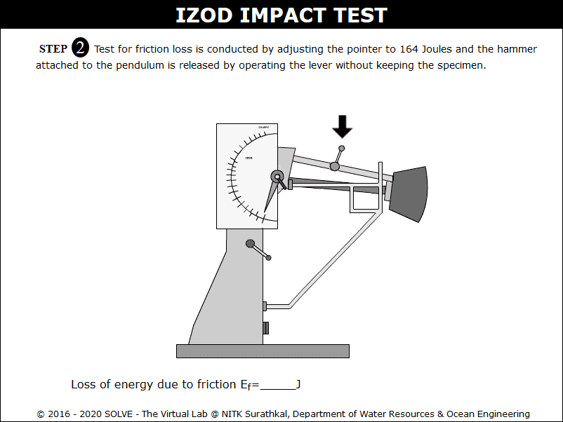](./images/proc3.png)

5. The value of friction loss will be obtained, then to move to the next step click on NEXT button.  
   [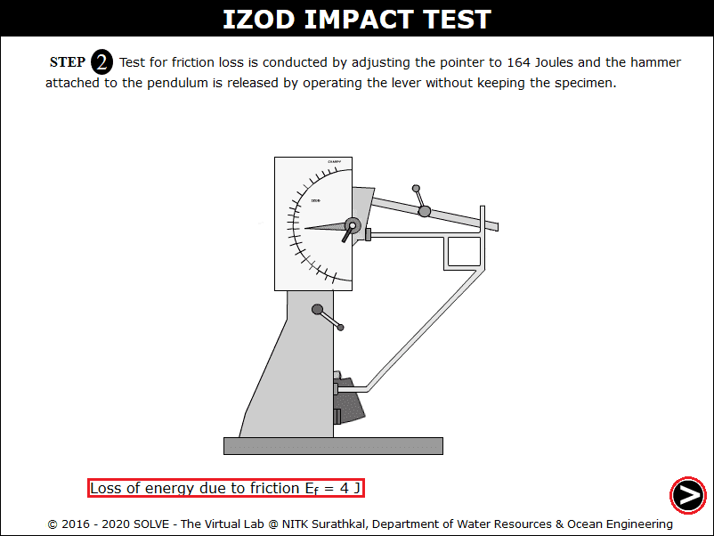](./images/proc4.png)

6. The specimen is placed in the anvil click on the next button.  
   [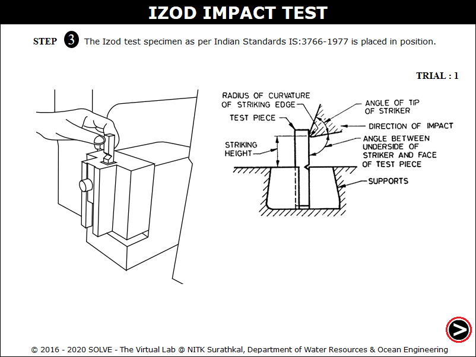](./images/proc6.png)

7. The pendulum is released to strike the specimen.  
   [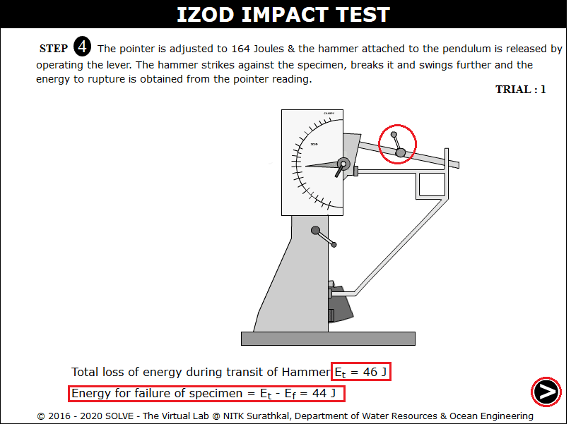](./images/proc7.png)

8. Observation of Trial 1 is as shown.  
   [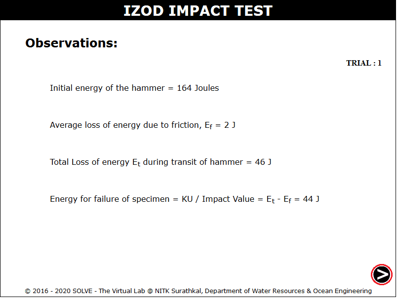](./images/proc8.png)

9. Change the specimen and repeat the above steps.  
   [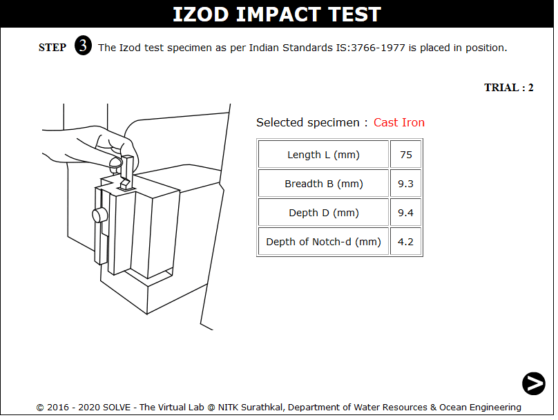](./images/proc9.png)

10. Observation of second trial.  
    [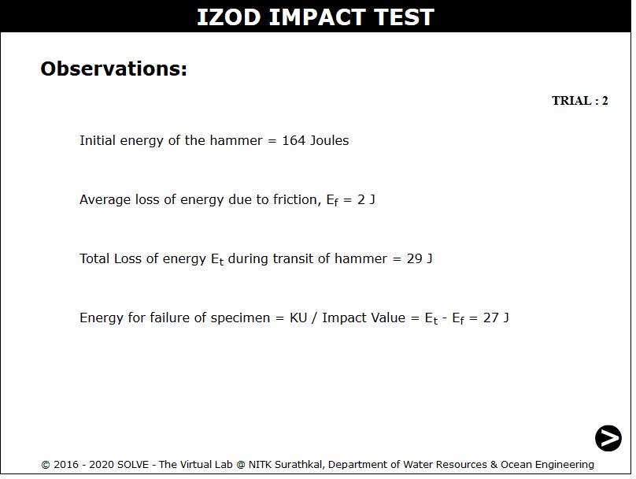](./images/proc10.png)

11. Results of all the trial.  
    [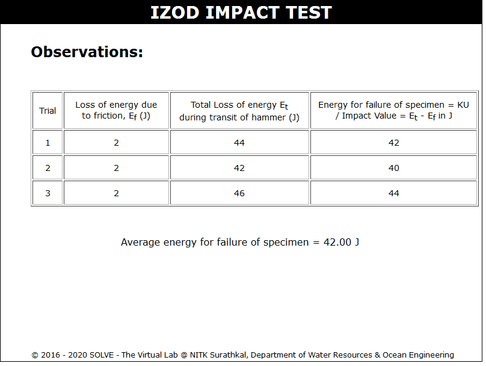](./images/proc11.png)
