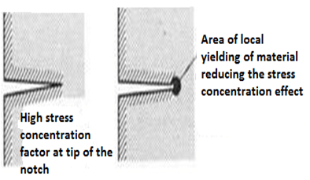
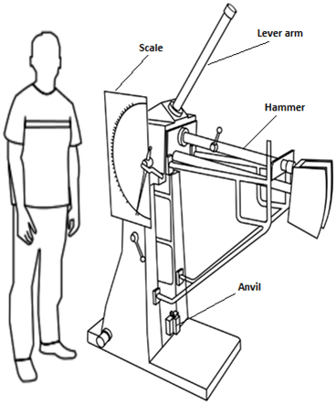
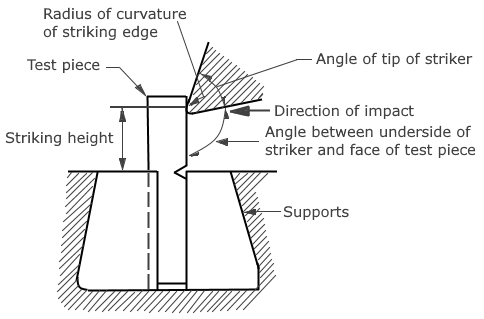
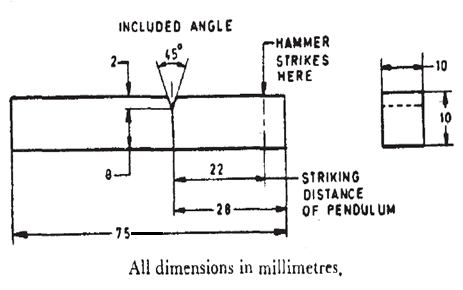

Impact test signifies toughness of material that is the ability of material to absorb energy during plastic deformation. Toughness takes into account both the strength and ductility of the material. There are two distinct type of toughness mechanism and in this case it is appropriate to consider notch as a very high local stress concentration.

The first type of mechanism occurs in ductile material. This is because very high stresses at the end of the notch produce local yielding of the material and local plastic flow at the crack tip. This has a action of blunting the sharp tip of the notch and hence reduces the stress concentration effect.

The second mechanism occurs in fibers, wood materials etc which have a weak interface. Local tensile stress developed at the front of a propagated crack opens up the interface and produces a crack sink i.e., blunts the crack by effectively increasing the radius of the crack tip. The stress-concentration at the notch increases with decreasing notch radius.

Impact testing machine consists of a pendulum suspended from a short shaft that rotates in ball bearing and swings midway between two rigid upright stands supported on a rigid base near the bottom of which are the specimen supports anvils. The knife-edge or striking edge is slightly rounded. The pendulum can be raised to any desired height and rested at that position. It is supported in the starting position by a catch and can be released by a trigger. The mechanism is so designed that the pendulum is not disturbed when the catch is released.

Impact strengths are generally lower as compared to strengths achieved under slowly applied loads. Indian standard method of izod impact test consists of breaking the specimen by one blow from a swinging hammer under specified condition, a notched test piece is gripped vertically with the bottom of the notch in the same plane as the upper face of the grips. The-blow is struck at a fixed position on the face having the notch. When a striker impacts the specimen, the specimen will absorb energy till it yields. At this point the specimen will begin to undergo plastic deformation at the notch. The specimen continues to absorb energy and work harden at the plastic zone, when the specimen can absorb no more energy fracture takes place.

Generally notch type specimens are used for impact tests. The notch in the test specimen serves to concentrate the stress, minimize plastic deformation, and direct the fracture to the part of the specimen behind the notch. Thus scatter in energy-to-break is reduced. The stress-concentration at the notch decreases with increase in notch radius. Also the use of notched specimen increases the sensitivity and reproducibility of the measurement.

**TEST SPECIMEN**:

The standard test piece of overall length of 75mm and a square cross-section of 10mm side with a standard 45° notch, 2mm deep is employed for the test. The notch is at 28mm from one end. In case of round specimen 11.4mm diameter with a standard 45° notch, 3.3mm deep is employed.

Single notch square test piece

Single notch round test piece

**Unbroken Test Piece**:

During impact test, if the test piece is not broken completely then the impact value obtained is indefinite. In test report it should be stated that the test piece was not broken by striking energy of the testing machine.

**RELEVANT INDIAN STANDARD FOR IZOD IMPACT TEST**:

1. IS 1598:1977-Method for Izod impact test of metals
2. IS:3766-1977- Method for calibration of pendulum impact testing machines for testing metals
